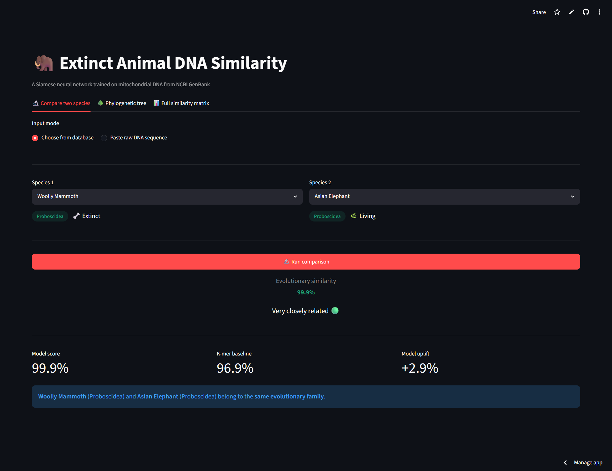
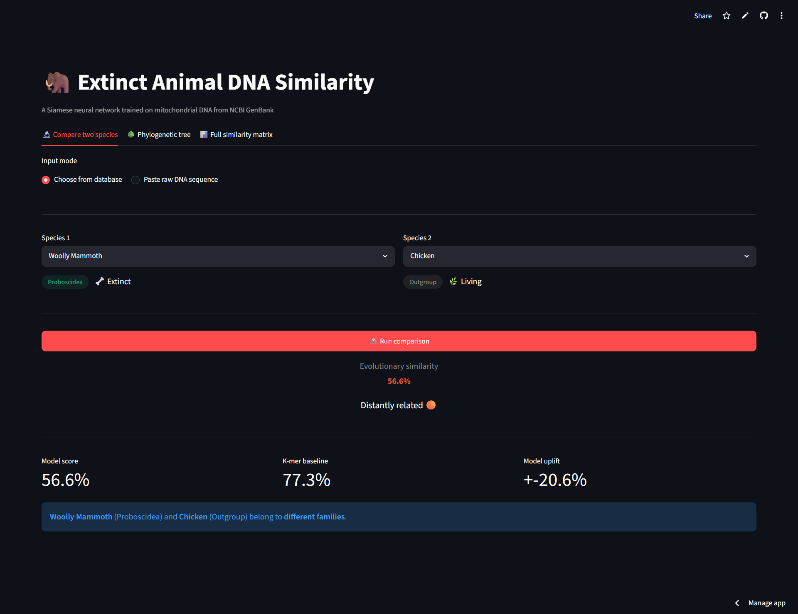
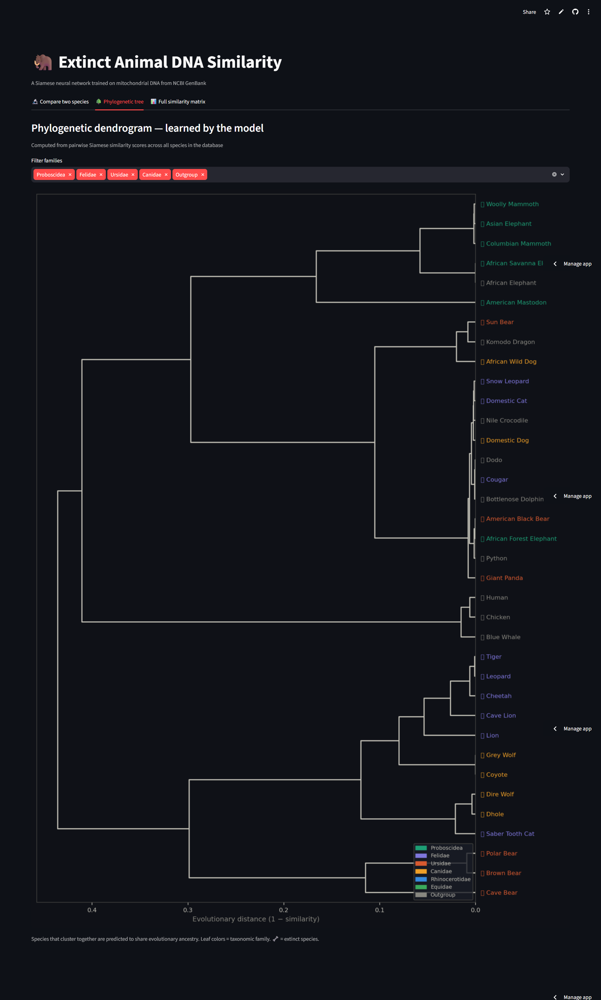
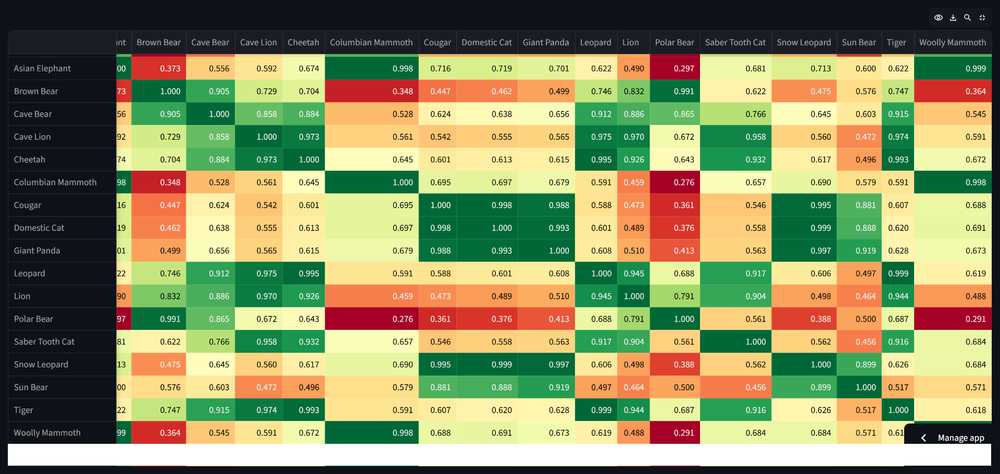

# 🦣 Extinct Animal DNA Similarity — Paleo Siamese Net

> A Siamese neural network trained on real mitochondrial DNA from NCBI GenBank that predicts evolutionary similarity between extinct and living animals.

🔗 **[Live Demo → paleo-siamese-net-5gw6ee3sjfqvpkjjk4aate.streamlit.app](https://paleo-siamese-net-5gw6ee3sjfqvpkjjk4aate.streamlit.app/)**

---

## What it does

Select any two species — living or extinct — and the model returns an evolutionary similarity score (0–100%) based on their mitochondrial DNA patterns. The model learns *which* sequence patterns encode evolutionary distance rather than just comparing raw base composition.

| Pair | Predicted Similarity (%) | K-mer Baseline (%) | Δ vs Baseline |
|------|-------------|----------------|--------|
| Woolly Mammoth vs Asian Elephant | **99.9%** | 96.9% | +2.9% |
| Woolly Mammoth vs American Mastodon | **87.2%** | 36.9% | +50.3% |
| Cave Bear vs Brown Bear | **90.6%** | 45.8% | +44.8% |
| Cave Lion vs Tiger | **97.4%** | 63.8% | +33.6% |
| Woolly Mammoth vs Chicken | **56.6%** | 77.3% | −20.6% ✅ |

The last row is critical — the model correctly *pushes down* the mammoth-chicken score (which the baseline inflates due to shared AT-content), proving it has learned real evolutionary signal and not just base composition.

---

## Demo

### Close relatives score high


### Distant species score low — model corrects the baseline

*Notice: k-mer baseline said 77.3% but the model correctly brings it down to 56.6% — this is the ML adding real value over classical methods.*

### Phylogenetic tree — species self-organise by evolutionary family

*No taxonomy labels used at inference. The model's pairwise scores produce this dendrogram — mammoths cluster with elephants, cats cluster together, bears cluster together.*

### Full pairwise similarity matrix

*Green = closely related. Red = distant. The block structure aligns with known evolutionary taxonomy.*

---

## Architecture

```
FASTA sequence (16,000 bp)
        │
        ▼
  K-mer encoding (k=6)
  Sliding window → 4,096-dim frequency vector
        │
        ▼
  ┌─────────────────────┐     ┌─────────────────────┐
  │   DNA Encoder        │     │   DNA Encoder        │  ← shared weights
  │  4096 → 1024 → 256  │     │  4096 → 1024 → 256  │
  │       → 128-dim      │     │       → 128-dim      │
  └──────────┬──────────┘     └──────────┬──────────┘
             │                            │
             └──────── cosine sim ────────┘
                            │
                     similarity score
                          0.0 – 1.0
```

Both sequences pass through the **same encoder** (Siamese = shared weights). The model learns a universal DNA embedding space where evolutionary relatives cluster together — without ever seeing taxonomy labels.

---

## Dataset

- **44 species** — 8 extinct, 36 living
- **Source:** NCBI GenBank mitochondrial genomes (free, public)
- **Families:** Proboscidea, Felidae, Ursidae, Canidae, Rhinocerotidae, Equidae + outgroups
- **Sequence length:** ~16,000 bp per species (complete mitochondrial genome)

**Extinct species:** Woolly Mammoth, Columbian Mammoth, American Mastodon, Saber-tooth Cat, Cave Lion, Cave Bear, Dire Wolf, Woolly Rhinoceros

---

## Training

| Detail | Value |
|--------|-------|
| Total pairs (after augmentation) | 15,136 |
| Same-family pairs | 165 |
| Validation accuracy | **96%** |
| Loss | Contrastive (α=0.7) + MSE (α=0.3) |
| Epochs | 150 |
| Optimizer | AdamW + CosineAnnealing LR |
| Class balancing | WeightedRandomSampler (5× upsample of positives) |

**Key decisions:**
- **Contrastive loss margin = 0.5** — forces unrelated species apart on the unit sphere; margin of 0.3 was insufficient (all pairs collapsed to high similarity)
- **3-level labels** (1.0 / 0.3 / 0.0) — same family / related order / unrelated — richer gradient signal than binary
- **Gaussian augmentation with asymmetric noise** — 15× augmentation, higher noise on negative pairs to create harder negatives
- **WeightedRandomSampler** — without this, 85% negative pairs cause the model to predict "similar" for everything

---

## App features

| Tab | Description |
|-----|-------------|
| **Compare two species** | Select or paste any two sequences → similarity % + color verdict + model vs baseline uplift |
| **Phylogenetic tree** | Dendrogram from pairwise model scores across selected families |
| **Full similarity matrix** | Interactive heatmap, all 44 species, exportable |

---

## Run locally

```bash
git clone https://github.com/YOUR_USERNAME/YOUR_REPO_NAME
cd YOUR_REPO_NAME

pip install -r requirements.txt
streamlit run app.py
```

---

## Stack

`Python` · `PyTorch` · `Biopython` · `Streamlit` · `scikit-learn` · `scipy` · `NCBI GenBank`

---

## What I learned

- **Siamese networks** are uniquely suited to similarity tasks because shared weights force the model to learn a universal representation, not memorise individual pairs
- **Class imbalance in pair datasets is severe** — 85% negatives requires weighted sampling, not just loss weighting
- **The margin hyperparameter matters more than architecture** — changing margin from 0.3 to 0.5 fixed the model collapsing to predict everything as similar
- **Real paleogenomic data is accessible** — NCBI GenBank has complete mitochondrial genomes for most extinct megafauna; the hard part is curating ground-truth labels from taxonomy
- **The baseline comparison is the story** — showing the model corrects the k-mer baseline on hard pairs (mammoth vs chicken) is more convincing than accuracy numbers alone

---

*Built from scratch using publicly available paleogenomic data. No pre-trained genomics models used.*
